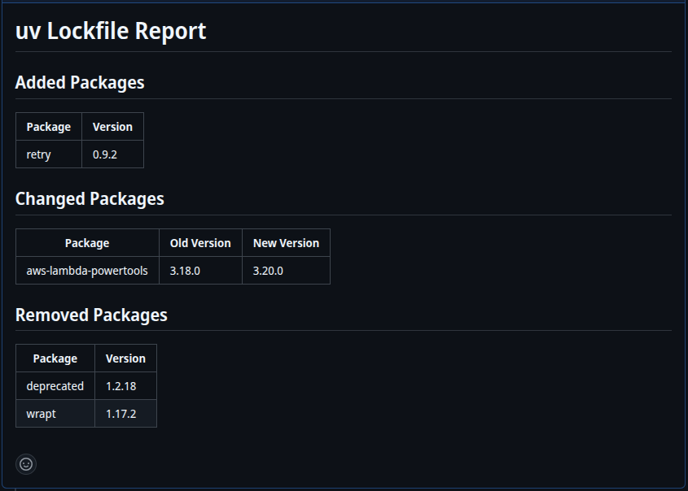

## uv Lock Report

[](https://codecov.io/gh/mw-root/uv-lock-report)

## Description

<!-- AUTO-DOC-DESCRIPTION:START - Do not remove or modify this section -->

Parses uv.lock changes and creates a report in a Pull Request Comments

<!-- AUTO-DOC-DESCRIPTION:END -->

Pull Requests with lockfile changes can be difficult to evaluate at a quick glance
and diffs are usually hidden by default.

This action provides a simple solution by determining the changes
and posting a comment with the summary.




## Example
```yaml
on:
  pull_request:

permissions:
  contents: read
  pull-requests: write

jobs:
  report:
    runs-on: ubuntu-latest
    steps:
      - uses: actions/checkout@08c6903cd8c0fde910a37f88322edcfb5dd907a8 # v5.0.0
        with:
          fetch-depth: 0

      - name: Report
        uses: mw-root/uv-lock-report@v1.0.0
        with:
          github-token: ${{ secrets.GITHUB_TOKEN }}
```

## Inputs

<!-- AUTO-DOC-INPUT:START - Do not remove or modify this section -->

|     INPUT     |  TYPE  | REQUIRED |  DEFAULT  |                         DESCRIPTION                         |
|---------------|--------|----------|-----------|-------------------------------------------------------------|
| github-token  | string |   true   |           |                        GitHub Token                         |
| output-format | string |  false   | `"table"` | The output format of the report. <br>One of: simple, table  |

<!-- AUTO-DOC-INPUT:END -->
