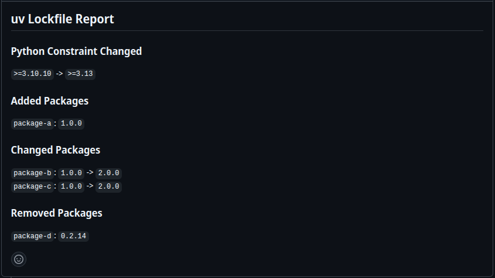
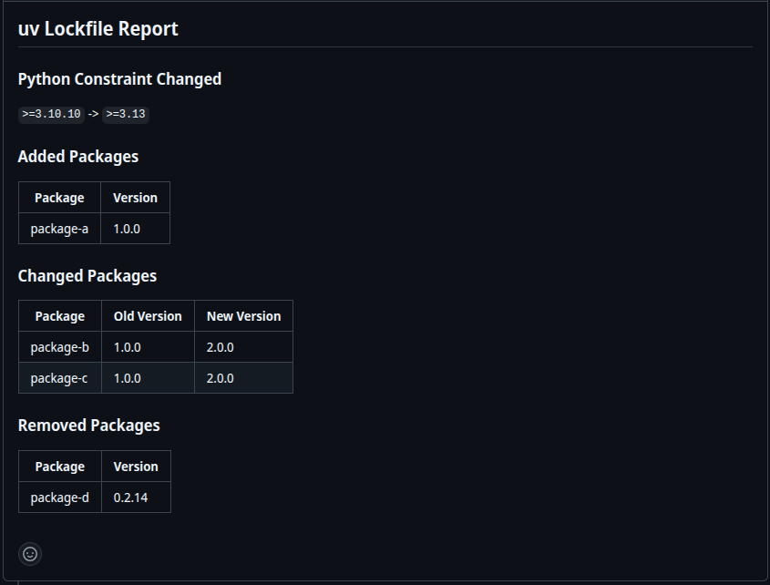

## uv Lock Report

[](https://codecov.io/gh/mw-root/uv-lock-report)

## Description

<!-- AUTO-DOC-DESCRIPTION:START - Do not remove or modify this section -->

Digests complex `uv.lock` diffs in Pull Requests and provides a simple,
readable summary of dependency changes as a PR comment.

<!-- AUTO-DOC-DESCRIPTION:END -->

Pull Requests with lockfile changes can be difficult to evaluate at a quick glance
and diffs are usually hidden by default.

This GitHub Action transforms complex `uv.lock` diffs into a clean, easy-to-read report.
It analyzes the changes between your base and head lockfiles, then posts a formatted comment showing exactly which packages were added, updated, or removed—including version changes and their severity (major, minor, or patch).

No more parsing through hundreds of lines of TOML diffs to understand what changed.


### Examples

The formatting can be chosen with the `output-format` input.

#### Simple Format ( Default )



#### Table Format



## Example
```yaml
on:
  pull_request:

permissions:
  contents: read
  pull-requests: write

jobs:
  report:
    runs-on: ubuntu-latest
    steps:
      - uses: actions/checkout@08c6903cd8c0fde910a37f88322edcfb5dd907a8 # v5.0.0
        with:
          fetch-depth: 0

      - name: Report
        uses: mw-root/uv-lock-report@v1.0.0
        with:
          github-token: ${{ secrets.GITHUB_TOKEN }}
```

## Inputs

<!-- AUTO-DOC-INPUT:START - Do not remove or modify this section -->

|     INPUT     |  TYPE  | REQUIRED |  DEFAULT   |                         DESCRIPTION                         |
|---------------|--------|----------|------------|-------------------------------------------------------------|
| github-token  | string |   true   |            |                        GitHub Token                         |
| output-format | string |  false   | `"simple"` | The output format of the report. <br>One of: simple, table  |

<!-- AUTO-DOC-INPUT:END -->
